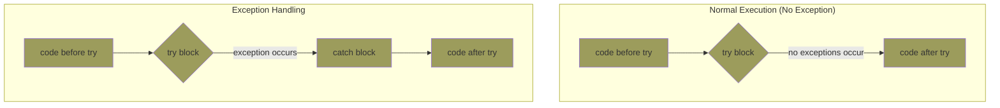
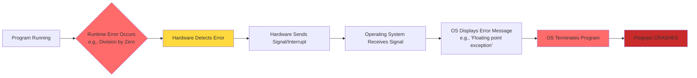

# Exception Handling

---

# Contents

<Toc minDepth="2" columns="2"/>

---

## Introduction

In the context of programming and software applications,
to simplify programming and make applications more robust means: 

- Strong, 
- reliable, 
- and able to handle problems gracefully.




---

[Hardware Detection vs. Language Handling]{class="text-2xl"}

**Hardware error detection (then and now):**

- Hardware always detects certain errors like:

    - Division by zero
    - Floating-point overflow
    - Invalid memory access
    - Arithmetic overflow


- When detected, hardware generates a signal/interrupt

---

**Early Programming Languages (without exception handling):**

Division by zero - Hardware always detects it:

```c
int x = 5 / 0;
```



- The language couldn't intercept or handle the error
- No way to recover or display a user-friendly message
- Just a crash with whatever message the OS provided


---

[App without exception handling]{class="text-2xl"}

<div class="w-fit mx-auto">

{.max-h-70vh}
</div>

an exception occurs, control goes to the operating system, where a message is displayed and the program

---

[User-defined Exceptions]{class="text-2xl"}

- Even without built-in exception-handling facilities, languages can handle user-defined, software-detected exceptions.
- **How it works:**
    - Exception is `detected within` a program unit (the function/subprogram)
    - Exception is `handled by` the unit's caller

---
layout: two-cols-title
---

::title::
[No built-in exception]{class="text-2xl"}

- A language that does not have exception handling capabilities can still define, detect, raise, and handle exceptions (user defined, software detected)

There are 3 alternatives:

1. Send an auxilary parameter or use the return value to indicate the return status of a subprogram

https://onlinegdb.com/ziTUbckH3M

::left::


```c
#include <stdio.h>
int divide(int a, int b, int *result) {
    if (b == 0) {
        return -1;  // Return error status
    }
    *result = a / b;
    return 0;  // Return success
}
```
::right::

```c

int main(){
    int a = 1;
    int b = 0;
    int result = 0;
    if(divide(a,b, &result)!=0){
        printf("An error occured");
    }
    printf("%d / %d = %d", a, b, result);
    return 0;
}
```

::default::


---

[No built-in exception (Cont.)]{class="text-2xl"}

2. Pass a label parameter to all subprograms (error return is to the passed label)

https://onlinegdb.com/Ld4vZsuwR

```f95
Program Example
      Real Weight
      
      Read(Unit=5, Fmt=1000, Err=100, End=999) Weight
      ! Normal execution - successful read
      Print *, "Weight read successfully:", Weight
      Goto 200
      
100   Print *, "Error reading data!"     ! Error handler
      Goto 200
      
999   Print *, "End of file reached!"    ! EOF handler
      
200   Continue                             ! Program flow label
      
1000  Format(F10.2)                        ! Format specification
      End
```

---

[No built-in exception (Cont.)]{class="text-2xl"}

3. Pass an exception handling subprogram to all subprograms 

https://onlinegdb.com/6JIneOko6

```c
#include <stdio.h>

void process_data(int data, void (*error_handler)(char*)) {
    if (data < 0) {
        error_handler("Invalid data!");  // Call the passed handler
        return;
    }
    // Normal processing
}

void my_error_handler(char* msg) {
    printf("Error: %s\n", msg);
}

int main()
{
    // Usage
    process_data(-5, my_error_handler);  // Pass error handler function
    return 0;
}
```

---

**Modern language with exception handling:**

```python
try:
    x = 5 / 0  # Hardware detects → Python catches it
except ZeroDivisionError:
    print("Please don't divide by zero!")  # Your friendly message
    # Program continues running!
```

- Hardware error detection works the same as always
- Modern languages can intercept and handle those hardware-detected errors instead of just crashing


---

- ### Basic Concepts (1.1)

- An `exception` is any unusual event (such as `end-of-file`) or error that is detectable by either hardware or software and may require special processing.
- The special processing that is required when an exception is detected is called `exception handling`.
- Exception handling is performed by a code unit or segment called `an exception handler`.
- An exception is `raised` or `throw` when its associated event occurs.

---
layout: two-cols-title
---

::title::
[Exception vs Without exception handling code]{class="text-2xl"}

::left::

```python
def AbyB(a , b):
    try:
        c = ((a+b) / (a-b))
    except ZeroDivisionError:
        print ("a/b result in 0")
    else:
        print (c)
  
# Driver program to test above function
AbyB(2.0, 3.0)
AbyB(3.0, 3.0)
```

::right::

```python
def AbyB(a , b):
    if a-b != 0 : # define and detect exception
        c = ((a+b) / (a-b))
    else: # handle exceptions
        print ("a/b result in 0")
        return # use return value to indicate status
    print (c)

# Driver program to test above function
AbyB(2.0, 3.0)
AbyB(3.0, 3.0)
```

::default::

---

[Without exception handling code]{class="text-2xl"}

```java
if (row >= 0 && row < 10 && 
    col >= 0 && col < 20)
    sum += mat[row][col]; // define and detect exception
else // handle exceptions
    System.out.println("Index range error on mat, row = " + row + " col = "+col);
```

- Readability and writeability are low


---
layout: two-cols-title
---

::title::
[Exceptions supports in languages]{class="text-2xl"}

::left::

**Languages Without Built-in Exception Handling**

| Language | Error Handling Method | Year |
|----------|----------------------|------|
| **C** | Return codes, errno | 1972 |
| **Go** | Multiple return values (result, error) | 2009 |
| **Rust** | Result<T, E> type | 2010 |
| **Zig** | Error unions | 2016 |
::right::

**Languages WITH Built-in Exception Handling**

| Language | Exception Syntax | Year |
|----------|------------------|------|
| **Lisp** | First language with exceptions | 1960s |
| **Ada** | exception handling blocks | 1980 |
| **C++** | try/catch/throw | 1985 |
| **Java** | try/catch/throw/finally | 1995 |
| **Python** | try/except | 1991 |
| **C#** | try/catch/throw/finally | 2000 |
| **Scala** | try/catch/throw | 2004 |

::default::
---

[Why design a modern language without an exception-handling mechanism?]{class="text-2xl"}

<div class="w-fit mx-auto">

{.max-h-40vh}
</div>

- https://softwareengineering.stackexchange.com/questions/258012/why-design-a-modern-language-without-an-exception-handling-mechanism


---

[Simple Memory Leak]{class="text-2xl"}


https://wokwi.com/projects/455542588801150977

```python
import micropython
import time
import gc
time.sleep(0.1) # Wait for USB to become ready

leak_storage = []

while True:

    leak_storage.append("A" * 2000)
    print("\n--- Current Status ---")
    # Show summary: Free vs Used
    print("Free RAM:", gc.mem_free(), "bytes")
    micropython.mem_info(1)
    time.sleep(1)
```


---

[Exception Memory Leak]{class="text-2xl"}

https://wokwi.com/projects/455543362158060545

```python
import gc
import micropython
import time

# Reserve emergency RAM so the final crash can still print
micropython.alloc_emergency_exception_buf(100)

error_log = []

print("--- Starting Exception Leak ---")

try:
    while True:
        try:
            # 1. Trigger a fake error
            raise ValueError("This is a heavy error message")
        except Exception as e:
            # 2. THE LEAK: Saving the exception object 'e' keeps it in RAM
            error_log.append(e) 
            
```

---

[Exception Memory Leak (Cont.)]{class="text-2xl"}

```python
            # 3. Report the damage
            free = gc.mem_free()
            print(f"Stored {len(error_log)} errors. Free RAM: {free}")
            
            if free < 2000:
                print("\nCRITICAL MEMORY LOW!")
                micropython.mem_info(1)
                
        time.sleep(0.05) # Slow it down so students can watch

except MemoryError:
    print("\n[STOP] The Pico can no longer create exceptions!")
    print("The 'Ambulance' has crashed.")
```


---

[Why design a modern language without an exception-handling mechanism?]{class="text-2xl"}

- The embeded system has limited resouces like Raspberry PI PICO has 264 KB of RAM

- The StackExchange snippet explains why we don't just use try-except everywhere in embedded systems:

    - Unacceptable Variability: In real-time systems (like controlling a motor or a drone), every millisecond counts. Exceptions require "stack unwinding," a process where the CPU has to search through memory to find the right handler. This makes the program's timing unpredictable.

    - Overhead: Stack unwinding is "heavy". For a Pi Pico with only 264KB of RAM, the background code needed to support exceptions eats up valuable space.

---
layout: two-cols-title
---

::title::
[Why Built-in Exception Handling is Good]{class="text-2xl"}

::left::

<Thumb color="red-light" width="300px" dir="down" v-drag="[221,82,40,40,180]" />

**Without it:**

- Must write `if (error) { handle }` everywhere
- Code becomes messy and long
- Same checking code repeated many times

```java
// Without exception handling - CLUTTERED CODE
if (row >= 0 && row < 10 && col >= 0 && col < 20)
    sum += mat[row][col];
else
    System.out.println("Index range error on mat, row = " 
    + row + " col = " + col);

// Later in code...
if (row >= 0 && row < 10 && col >= 0 && col < 20)
    result = mat[row][col];
else
    System.out.println("Index range error...");
```

::right::

<Thumb color="green-light" width="300px" v-drag="[690,81,40,40]" />

**With it:**

- Write clean code
- Compiler adds checks automatically
- Code is shorter and cleaner

```java
// With exception handling - CLEAN CODE
try {
    sum += mat[row][col];      // No manual checking!
    result = mat[row][col];    // No manual checking!
    mat[row][col] = value;     // No manual checking!
} catch (ArrayIndexOutOfBoundsException e) {
    System.out.println("Index error: " + e.getMessage());
}

// The compiler inserts bounds checking automatically
// You don't see it, but it's there!
```

::default::


---

[Advantages of Built-in Exception Handling]{class="text-2xl"}

- Error detection code is tedious to write and it clutters the program 

- Exception handling encourages programmers to consider many different possible errors 

- Exception propagation allows a high level of reuse of exception handling code

---

[How to handle Exceptions?]{class="text-2xl"}

- Do nothing
  - program crashes if the execution occurs

- Propagate (throws) it
  - tell the method's caller about it and let them decide what to do

- Resolve (try-catch) it in our method
  - fix it or tell the user about it and let them decide what to do


---
layout: two-cols-title
---

::title::
[Exception Propagation]{class="text-2xl"}

**What is Exception Propagation?**

- An exception raised in one function can be handled in a different function (usually the caller).

::left::

- Example Without Propagation (Old Way)

```java
// Function 1
void readFile() {
    // Must handle error HERE
    if (file not found) {
        System.out.println("Error!");
    }
}
// Function 2
void writeFile() {
    // Must handle error HERE
    if (file not found) {
        System.out.println("Error!");
    }
}
```

::right::

- Example With Propagation (Modern Way)

```java
void readFile() throws IOException {
    // No error handling here
    // Just let exception propagate
}
void writeFile() throws IOException {
    // No error handling here
    // Just let exception propagate
}
void main() {
    try {
        readFile();
        writeFile();
    } catch (IOException e) {
        // ONE handler for all file errors!
        System.out.println("File error: " + e.getMessage());
    }
}
```

::default::


---
layout: two-cols-title
---

::title::
## Design Issues

::left::

- How and where are exception handlers specified and what is their scope.
- How is an exception occurrence bound to an exception handler?
- Can information about the exception be passed to the handler?
- How are user-defined exceptions specified?
- Can predefined exceptions be explicitly raised?
- Are hardware-detectable errors treated as exceptions that can be handled?

::right::

```python
try:
    f = open(filename)
except OSError as e:
    if e.errno == errno.ENOENT:
        logger.error('File not found')
    elif e.errno == errno.EACCES:
        logger.error('Permission denied')
    else:
        logger.error('Unexpected error: % d', e.errno)
```

::default::

---

[Exception-handling control flow]{class="text-2xl"}


 

---

[User-defined Exceptions]{class="text-2xl"}

- Even without built-in exception-handling facilities, languages can handle user-defined, software-detected exceptions.
- **How it works:**
    - Exception is `detected within` a program unit (the function/subprogram)
    - Exception is `handled by` the unit's caller


---
layout: two-cols-title
---

::title::
[Design 1]{class="text-2xl"}

::left::
1. **Status variable (parameter)**: Pass an auxiliary parameter; the called function sets its value to indicate success/failure  https://onlinegdb.com/8xXau0Gu9

```c
void readFile(char* filename, int* status) {
    FILE* f = fopen(filename, "r");
    if (f == NULL) {
        *status = ERROR_FILE_NOT_FOUND;  // Detected here
        return;
    }
    *status = SUCCESS;
}
void main() {
    int status;
    // Pass status variable
    readFile("data.txt", &status);  
    if (status == ERROR_FILE_NOT_FOUND) {  // Handle here
        printf("Error: File not found!\n");
    }
}
```

::right::


2. **Return value (C style)**: The function returns a value that serves as an error indicator https://onlinegdb.com/wbrpVM0QF

```c
// Called function detects error and returns status
int readFile(char* filename) {
    FILE* f = fopen(filename, "r");
    if (f == NULL) {
        return ERROR_FILE_NOT_FOUND;  // Detected and returned
    }
    // ... read file ...
    return SUCCESS;
}

// Caller handles the error
void main() {
    int result = readFile("data.txt");
    
    if (result == ERROR_FILE_NOT_FOUND) {  // Handle here
        printf("Error: File not found!\n");
    }
}
```
::default::

---

[Design 1]{class="text-2xl"}

3. **Multiple Return Values (Go style)**: https://onlinegdb.com/uyio-GGST

```go
func readFileDetailed(filename string) (content string, bytesRead int, err error) {
	data, err := os.ReadFile(filename)
	
	if err != nil {
		return "", 0, fmt.Errorf("error reading %s: %w", filename, err)
	}
	
	if len(data) == 0 {
		return "", 0, fmt.Errorf("file %s is empty", filename)
	}
	
	return string(data), len(data), nil
}
```

---

[Design 2]{class="text-2xl"}

- Pass a label parameter to the subprogram https://onlinegdb.com/qFM6qngRE


```fortran-fixed-form
          CALL DIVIDE(X, Y, RESULT, *100, *200)
          
          PRINT *, 'Result:', RESULT
          GOTO 999
          
  100     PRINT *, 'ERROR: Division by zero!'
          GOTO 999
          
  200     PRINT *, 'ERROR: Overflow!'
          
  999     STOP
```

---
layout: two-cols-title
---

::title::
[Design 3]{class="text-2xl"}

- To have handler defined as a separate subprogram whose name is passed as a parameter to the called unit. https://onlinegdb.com/-LvA9FQ98

::left::

```csharp
using System;
class Program
{
    // Handler subprogram (defined by caller)
    static void ErrorHandler(string message)
    {
        Console.WriteLine($"ERROR: {message}");
    }
    // Called unit (receives handler as parameter)
    static void Divide(int a, int b, out int result, 
        Action<string> handler)
    {
        if (b == 0)
        {   // Calls the handler
            handler("Division by zero!");  
            result = 0;
            return;
        }
        result = a / b;
    }
```
::right::

```csharp 
    static void Main()
    {
        int result;
        // Must pass handler EVERY time
        // Uses handler
        Divide(10, 0, out result, ErrorHandler);  
        // Must pass even if not needed
        Divide(10, 2, out result, ErrorHandler);  
        Console.WriteLine($"Result: {result}");
    }
}
```

<StickyNote color="amber-light" textAlign="left" width="180px" title="Note" v-drag="[469,386,409,131]">

- You need to pass a handler subprogram with every call to every subprogram, whether it is needed or not
- To handle several different exception types, several handler routines must be passed, which complicates the code
</StickyNote>

::default::


---
layout: two-cols-title
---

::title::
[Why Built-in Exception Handling is Good]{class="text-2xl"}

::left::

<Thumb color="red-light" width="300px" dir="down" v-drag="[221,82,40,40,180]" />

**Without it:**

- Must write `if (error) { handle }` everywhere
- Code becomes messy and long
- Same checking code repeated many times

```java
// Without exception handling - CLUTTERED CODE
if (row >= 0 && row < 10 && col >= 0 && col < 20)
    sum += mat[row][col];
else
    System.out.println("Index range error on mat, row = " 
    + row + " col = " + col);

// Later in code...
if (row >= 0 && row < 10 && col >= 0 && col < 20)
    result = mat[row][col];
else
    System.out.println("Index range error...");
```

::right::

<Thumb color="green-light" width="300px" v-drag="[690,81,40,40]" />

**With it:**

- Write clean code
- Compiler adds checks automatically
- Code is shorter and cleaner

```java
// With exception handling - CLEAN CODE
try {
    sum += mat[row][col];      // No manual checking!
    result = mat[row][col];    // No manual checking!
    mat[row][col] = value;     // No manual checking!
} catch (ArrayIndexOutOfBoundsException e) {
    System.out.println("Index error: " + e.getMessage());
}

// The compiler inserts bounds checking automatically
// You don't see it, but it's there!
```

::default::

---
layout: two-cols-title
---

::title::
[Exception Propagation]{class="text-2xl"}

**What is Exception Propagation?**

- An exception raised in one function can be handled in a different function (usually the caller).

::left::

- Example Without Propagation (Old Way)

```java
// Function 1
void readFile() {
    // Must handle error HERE
    if (file not found) {
        System.out.println("Error!");
    }
}
// Function 2
void writeFile() {
    // Must handle error HERE
    if (file not found) {
        System.out.println("Error!");
    }
}
```

::right::

- Example With Propagation (Modern Way)

```java
void readFile() throws IOException {
    // No error handling here
    // Just let exception propagate
}
void writeFile() throws IOException {
    // No error handling here
    // Just let exception propagate
}
void main() {
    try {
        readFile();
        writeFile();
    } catch (IOException e) {
        // ONE handler for all file errors!
        System.out.println("File error: " + e.getMessage());
    }
}
```

::default::


---
layout: two-cols-title
---

::title::
[Exceptions supports in languages]{class="text-2xl"}

::left::

**Languages Without Built-in Exception Handling**

| Language | Error Handling Method | Year |
|----------|----------------------|------|
| **C** | Return codes, errno | 1972 |
| **Go** | Multiple return values (result, error) | 2009 |
| **Rust** | Result<T, E> type | 2010 |
| **Zig** | Error unions | 2016 |
::right::

**Languages WITH Built-in Exception Handling**

| Language | Exception Syntax | Year |
|----------|------------------|------|
| **Lisp** | First language with exceptions | 1960s |
| **Ada** | exception handling blocks | 1980 |
| **C++** | try/catch/throw | 1985 |
| **Java** | try/catch/throw/finally | 1995 |
| **Python** | try/except | 1991 |
| **C#** | try/catch/throw/finally | 2000 |
| **Scala** | try/catch/throw | 2004 |

::default::

---

### Design Issues (1.2)

The design issues for an exception-handling system in programming language.

- Predefinded Exceptions
    - Implicitly raised by errors detected by hardware
- User-defined Exception
    - Exlicitly raided by user code

---

[First Design Issue: Binding Exceptions to Handlers]{class="text-2xl"}
This occurs at two levels:

- Unit Level:

    - How to handle multiple exceptions that can be raised by different statements within a single unit
    - Example: A division-by-zero error handler might need to handle multiple division operations
    - The handler may need to identify which specific statement raised the exception

---

[First Design Issue: Binding Exceptions to Handlers]{class="text-2xl"}

- Higher Level (Propagation):

    - What happens when there's no local exception handler in the unit where the exception is raised?
    - The language designer must decide whether to propagate the exception to another unit, and if so, where
    - Trade-off:

        - If handlers must be local → many handlers must be written, complicating code
        - If exceptions propagate → a single handler might handle exceptions from several program units, requiring the handler to be more general than ideal


    - The challenge is making information about the exception available to the handler

---

[Second Design Issue: Control Flow After Handler Execution]{class="text-2xl"}

- After an exception handler executes, control can either:

1. Transfer outside the handler (to somewhere else in the program)
2. Terminate the program

- Terminology:

    - Continuation: Control continues after the handler executes
    - Resumption: In cases where the error is not fatal, execution can resume

---

[Second Design Issue: Control Flow After Handler Execution]{class="text-2xl"}

- Considerations:

    - Returning to the statement that raised the exception may seem logical, but it's only useful if the handler can modify values to prevent re-raising the exception
    - Otherwise, the exception will simply be re-raised
    - The required modification for an error exception is often difficult and may not be sound practice
    - This allows removing the problem without removing its cause

---

[Second Design Issue: Control Flow After Handler Execution]{class="text-2xl"}

- Related Concept: Finalization

    - When exception handling is included, a subprogram can terminate in two ways:

        1. Normal completion
        2. Encountering an exception


    - Finalization: The ability to specify code that must execute regardless of how the subprogram terminates
    - This is important for cleanup operations (closing files, releasing resources, etc.)

---

[Third Design Issue: User-Defined Exception Specification]{class="text-2xl"}

- How are user-defined exceptions specified?
- The usual answer: require declaration in a specification part of the program unit where they can be raised
- The scope of a declared exception is typically the scope of the program unit containing the declaration

---

[Fourth Design Issue: Predefined Exceptions]{class="text-2xl"}

When a language provides predefined exceptions, several design issues arise:

1. Default Handlers: Should the language run-time system provide default handlers for built-in exceptions, or should users be required to write handlers for all exceptions?
2. Explicit Raising: Can predefined exceptions be raised explicitly by the user program? (This is useful for testing or when the same error condition is detected by software)
3. Scope and Convenience: Whether predefined exceptions can be raised explicitly depends on convenience—are there software-detectable situations where users would want to use a predefined handler?

---

[Fifth Design Issue: Hardware-Detectable Errors]{class="text-2xl"}

- Can hardware-detectable errors be handled by user programs?
- If user programs cannot handle exceptions (those obviously caused by software error), the related question is: should there be any predefined exceptions at all?
- Predefined exceptions are implicitly raised by either hardware or system software

---

[Summary of Exception-Handling Design Issues]{class="text-2xl"}

The exception-handling design issues can be summarized as follows:

- Handler Specification and Scope: How and where are exception handlers specified, and what is their scope?
- Binding Exceptions to Handlers: How is an exception occurrence bound to an exception handler?
- Information Passing: Can information about an exception be passed to the handler?
- Control Flow (Continuation/Resumption): Where does execution continue, if at all, after an exception handler completes its execution?
- Finalization: Is some form of finalization provided?
- User-Defined Exceptions: How are user-defined exceptions specified?

---

[Summary of Exception-Handling Design Issues]{class="text-2xl"}

- Default Handlers for Predefined Exceptions: If there are predefined exceptions, should there be default exception handlers for programs that do not provide their own?
- Explicit Raising of Predefined Exceptions: Can predefined exceptions be explicitly raised?
- Hardware Errors as Exceptions: Are hardware-detectable errors treated as exceptions that may be handled?
- Existence of Predefined Exceptions: Are there any predefined exceptions?