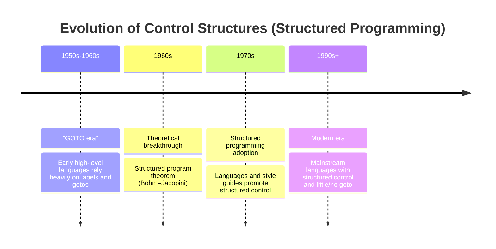
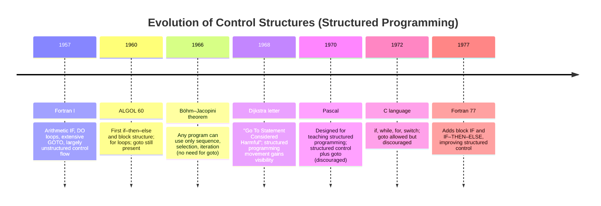

# Statement-Level Control Structures


---
layout: two-cols
---

::left::

```c 
#include <stdio.h>
//chapter 9
double addDouble(double a, double b){
    try{ // chapter 14 (try-catch)
        a - a/b;
    }catch(...){
        cout << "divide by zero";
    }
    return a | b;
}
int main(){
    // chapter 5,6
    int x = 5;
    double y;

    // chapter 7
    x = y * 6 + 1 * x;

    // chapter 8
    if(x<10){
        // chapter 9
        y = addDouble(2.5, 1.2);
    }
    // chapter 9
    return 0;
}
```

<Box v-drag="[86,364,196,96]" shape="s-s-1-100" color="red-light" width="300px" />

::right::

<div class="grid grid-cols-1">
    <div class="p-2">

**Chapter 5.** Names, Bindings, and Scopes
   
   </div>
    <div class="p-2">

**Chapter 6.** Data Types

</div>
    <div class="p-2">

**Chapter 7.** Expressions and Assignements Statements

</div>
    <div class="border border-red-500 bg-neutral-100 p-2">

**Chapter 8.** Statement-Level Control Structures
</div>
    <div class="p-2">

**Chapter 9.** Subprograms
</div>
</div>

---

# Contents

<Toc minDepth="2" maxDepth="3" columns="2"/>


---

## Introduction (1.)

**Structured programming**

- A programming paradigm that improves computer programs in terms of:

    - Clarity
    - Quality
    - Development time


- A code block is structured when it has a single entry point and single exit point, as shown in the flowchart or NS diagrams.
- Structured programming is a method that makes it easier to verify program correctness.

---

[Control structure]{class="text-2xl"}

- A control statement and the collection of statements whose execution it controls

**Example:**
```c
if (x > 0) {        // control statement
    y = x * 2;      // statements being controlled
    z = y + 1;
}
```

- Characteristics in structured programming:
    - Single entry point
    - Single exit point

---

**Three types of control structures:**

- Sequence: statements execute one after another
- Selection (if-then-else): choose between alternative control flow paths
- Iteration (loops): repeated execution of statements 

**Visual representation:**

- Nassi–Shneiderman diagram (blue) https://en.wikipedia.org/wiki/Nassi%E2%80%93Shneiderman_diagram
- Flow charts (green)

<div class="flex flex-col w-full">
<div>


</div>

<div class="flex justify-center w-full">
<div class="w-1/3 text-center text-orange-500">Sequence</div>
<div class="w-1/3 text-center text-orange-500">If-then-else</div>
<div class="w-1/3 text-center text-orange-500">Repetition</div>
</div>
</div>

---

[Computations]{class="text-2xl"}

- Imperative language
    - Computations are accomplished by evaluating expressions and assigning resulting values to variables
    - To make programs flexible and powerful, two additional mechanisms are needed:

        - Selection: choosing among alternative control flow paths
        - Iteration: repeated execution of statements or sequences of statements
    - These are called **control statements**

- Functional languages:

    - Computations are accomplished by evaluating expressions and applying functions to given parameters
    - The flow of execution is controlled by other expressions and functions

---
layout: two-cols-title
---

::left::

**Imperative languages (C, Java, Python):**

```c
// Computation by assignment and control flow
int sum = 0;
for (int i = 1; i <= 10; i++) {
    sum = sum + i;  // assigning values
}
// Result: sum = 55
```

::right::

**Functional languages (Haskell, Lisp):**

```haskell
-- Computation by applying functions
sum [1..10]  -- applying the sum function
-- Result: 55
```

::default::

Both accomplish the same computation (adding numbers 1-10), but:

- Imperative: uses assignments and control statements (for loop)
- Functional: uses function application (sum function)


---

[Historical progression:]{class="text-2xl"}



---

[Historical progression:]{class="text-2xl"}



---

[Historical development]{class="text-2xl"}

- Fortran was the first successful programming language, designed for the IBM 704
- Its control statements were directly related to machine language instructions
- At the time, little was known about the difficulty of programming
- By today's standards, Fortran's control statements are seriously lacking

---
layout: quote
---


 "Little was known about the difficulty"

---

[Explain]{class="text-2xl"}

- In 1957, programmers thought this Fortran code was fine!

**Why?**

- Coming from assembly: everything was jumps/branches
- No large programs yet to see the mess
- No experience with maintenance


---
layout: two-cols-title
---

::title::
[Fortran Example]{class="text-2xl"}

https://en.wikibooks.org/wiki/Fortran/Fortran_examples


::left::

```
C AREA OF A TRIANGLE - HERON'S FORMULA
C INPUT - CARD READER UNIT 5, INTEGER INPUT
C OUTPUT -
C INTEGER VARIABLES START WITH I,J,K,L,M OR N
      READ(5,501) IA,IB,IC
  501 FORMAT(3I5)
      IF (IA) 701, 777, 701
  701 IF (IB) 702, 777, 702
  702 IF (IC) 703, 777, 703
  777 STOP 1
  703 S = (IA + IB + IC) / 2.0
      AREA = SQRT( S * (S - IA) * (S - IB) * (S - IC) )
      WRITE(6,801) IA,IB,IC,AREA
  801 FORMAT(4H A= ,I5,5H  B= ,I5,5H  C= ,I5,8H  AREA= ,F10.2,
     $13H SQUARE UNITS)
      STOP
      END
```

::right::

```
IF (IA) 701, 777, 703
```

**Meaning:**
- If IA < 0 → goto line 701
- If IA = 0 → goto line 777 (STOP - error!)
- If IA > 0 → goto line 703

::default::


---
layout: two-cols
---


::left::
[Theoretical research (1960s-1970s):]{class="text-2xl"}

- Böhm and Jacopini (1966) proved that although a simple goto statement is minimally sufficient, a well-designed language needs only two types of control statements:

    - One for choosing between two control flow paths (selection)
    - One for logically controlled iterations (loops)


- This means the unconditional branch (`goto`) is superfluous—potentially useful but not essential

::right::

- Only `goto` is hard to read

https://onlinegdb.com/Y-QG2OCki

```c
#include <stdio.h>
int main(){
    int i=0, j=5;
    printf("=== With goto (hard to read) ===\n");
    i = 0;
    loop:
        printf("i = %d\n", i);
        i++;
        if(i < j) goto loop;
    
    printf("\n=== With while (clear!) ===\n");
    i = 0;
    while(i < j) {
        printf("i = %d\n", i);
        i++;
    }
    printf("\n*** Both produce the same output! ***\n");
    printf("*** goto is SUPERFLUOUS (not needed)! ***\n");
    return 0;
}
```


---

[Writability vs. Readability trade-off:]{class="text-2xl"}

- More control statements → Programs are easier to write

    - Example: Using a for loop for counting is easier than using a while loop


- Too many control statements → Programs become harder to read

    - Programmers must learn more statements
    - Readers may not know all the statements used

---

## Selection Statements (2.)

A selection statement provides the means of choosing between two or more execution paths in a program.
  - One-way selection
  - Two-way selection
  - N-way selection or multiple selection


---

[One-way selection]{class="text-2xl"}

- General form:

```
if control_expression
    then clause
```

- Control expression:
    - In C89, C99, Python, and C++, the control expression can be arithmetic
    - In languages such as Ada, Java, Ruby, and C#, the control expression must be Boolean

<div class="mx-auto w-[600px]">


</div>

---
layout: two-cols-title
---

::title::
[Then clause]{class="text-2xl"}

- In contemporary languages, then clauses can be single or compound statements

::left::

- Ruby
```
if conditional [then]
   code...
end
```

::right::

https://onlinegdb.com/MXEpt_747

```ruby
score = 85

if score >= 80 then puts "Grade B" end # then is required

if score >= 80 
    puts "Grade B" 
end
```


---

[Then clause]{class="text-2xl"}

- In Perl, all clauses must be delimited by braces (they must be compound even if there is only 1 statement)


```perl
my $a = 1;
if($a == 1) {
   print("Welcome to the Perl if tutorial!\n");
   print("another form of the Perl if statement\n");
}

```

- Python uses **indentation** to define clauses

```python
if x > y :
        x = y
        print "case 1"

```

---
layout: two-cols-title
---

::title::
[Two-Way selection]{class="text-2xl"}

::left::

``` 
if control_expression
  then clause
  else clause
```

```cpp
cin >> option ;  cost = 10;
 if  ( option==1 ) {
        cost += 10 ;
 } else {
	 cost += 20 ;
}

```

<Line :x1="0" :y1="0" :x2="50" :y2="50" :width="2" color="red" v-drag="[51,256,40,40]" />
<Line :x1="0" :y1="0" :x2="50" :y2="50" :width="2" color="red" v-drag="[90,203,40,40]" />
<Line :x1="0" :y1="0" :x2="50" :y2="50" :width="2" color="red" v-drag="[47,209,40,40]" />
<Line :x1="0" :y1="0" :x2="50" :y2="50" :width="2" color="red" v-drag="[175,180,40,40]" />

::right::

<div class="mx-auto w-[300px]">


</div>

```cpp
cin >> option ;  cost = 10;
 if  ( option==1 )
        cost += 10 ;
  else
        cost += 20 ;

```

---
layout: two-cols-title
---

::title::

[Dangling else]{class="text-2xl"}

::left::

```c
if(sum==0)
    result = 0;
else
    result = 1;
```

<ArrowDraw color="red" v-drag="[454,115,40,40]"/>

::right::

```java
if (sum == 0) // (1)
  if (count == 0) // (2)
    result = 0;
else // which if clause (1) or (2) are match?
  result = 1;
```

::default::

- Which `if` gets the `else`?  
- The Java, C, C++ and C# can ignore braces `{}` that might be ambigous **(dangling else)**
- Java's static semantics rule: `else` matches with the nearest `if` (including C, C++, and C#)

---

[Nesting Selectors]{class="text-2xl"}

<ArrowDraw color="red" v-drag="[79,180,40,40,180]"/>
<ArrowDraw color="red" v-drag="[170,124,40,40,180]"/>

- To force an alternative semantics, compound statements may be used:

```c
if (sum == 0) {
    if (count == 0)
        result = 0;
}
else result = 1;
```

- The above solution is used in C, C++, and C#
- Perl requires that all then and else clauses to be compound and avoid the above problem

---
layout: two-cols-title
---

::title::

[For Perl]{class="text-2xl"}

- But Perl is always require braces `{}` to avoid ambigous **(dangling else)**

::left::

**Case 1**

```perl
if (sum == 0){
    if (count == 0){
        result = 0;
    }
} else {
    result = 1;
}
```

::right::

**Case 2**

```perl

if (sum == 0){
    if (count == 0){
        result = 0;
    }
    else {
        result = 1;
    }
}
```

---
layout: two-cols-title
---

::title::
[For Ruby]{class="text-2xl"}

- The problem can also be solved by alternative means of forming compound statements, e.g., using a special word `end` in Ruby

<ArrowDraw color="red" v-drag="[102,322,40,40,180]"/>

<ArrowDraw color="red" v-drag="[122,302,40,40,185]"/>

<ArrowDraw color="red" v-drag="[532,321,40,40,180]"/>

<ArrowDraw color="red" v-drag="[545,264,40,40,185]"/>
::left::

**Case 1**

```ruby
if sum == 0 then
  if count == 0 then
    result = 0
  else
    result = 1
  end
end
```
::right::

**Case 2**

```ruby
if sum == 0 then
  if count == 0 then
    result = 0
  end
else
  result = 1
end
```
---
layout: two-cols-title
---

::title::
[Multiple-Way Selection Using if]{class="text-2xl"}

::left::

- Multiple selectors can appear as direct extensions to two-way selectors, using else-if clauses, for example in Python:

```python
if count < 10 :
	bag1 = True
elif count < 100 :
    bag2 = True
elif count < 1000 :
    bag3 = True

```

::right::

- More readable than deeply nested two-way selectors!
- Can compare ranges

<div class="mx-auto w-[250px]">


</div>


---
layout: two-cols-title
---

::title::
[Add else to prevent dangling else]{class="text-2xl"}

::left::
<div class="mx-auto w-[250px]">


</div>


::right::

```cpp
cin >> option ;  cost = 10;
 if  ( option==1 ) {
        cost += 10 ;
} else if ( option==2 ) {
                cost += 20 ;
          } else if ( option==3 ) {
                cost += 30 ;
          } 
          else {
                cost += 40 ;
          }

```

---
layout: two-cols-title
---

::title::
[Ignore braces]{class="text-2xl"}

::left::

<Line :x1="0" :y1="0" :x2="50" :y2="50" :width="2" color="red" v-drag="[151,100,40,40]" />
<Line :x1="0" :y1="0" :x2="50" :y2="50" :width="2" color="red" v-drag="[40,202,40,40]" />
<Line :x1="0" :y1="0" :x2="50" :y2="50" :width="2" color="red" v-drag="[42,241,40,40]" />
<Line :x1="0" :y1="0" :x2="50" :y2="50" :width="2" color="red" v-drag="[41,131,40,40]" />
<Line :x1="0" :y1="0" :x2="50" :y2="50" :width="2" color="red" v-drag="[43,168,40,40]" />
<Line :x1="0" :y1="0" :x2="50" :y2="50" :width="2" color="red" v-drag="[91,200,40,40]" />
<Line :x1="0" :y1="0" :x2="50" :y2="50" :width="2" color="red" v-drag="[201,175,40,40]" />
<Line :x1="0" :y1="0" :x2="50" :y2="50" :width="2" color="red" v-drag="[198,138,40,40]" />
```cpp

cin >> option; cost = 10;
if (option==1) {
    cost += 10;
} else if (option==2) {
    cost += 20;
} else if (option==3) {
    cost += 30;
} else {           
    cost += 40;    
}
```

::right::

```cpp
cin >> option ;  cost = 10;
if  ( option==1 )  
    cost += 10 ;
else if ( option==2 )  
    cost += 20 ;
else if ( option==3 )  
    cost += 30 ;
else
    cost += 40 ;

```
---

[Implement with Switch?]{class="text-2xl"}

```c
#include <iostream>
using namespace std;
int main () {
   // local variable declaration:
   int a;
   cin >> a;
   // check the boolean condition
   if( a == 10 ) {
      // if condition is true then print the following
      cout << "Value of a is 10" << endl;
   } else if( a == 20 ) {
      // if else if condition is true
      cout << "Value of a is 20" << endl;
   } else if( a == 30 ) {
      // if else if condition is true 
      cout << "Value of a is 30" << endl;
   } else {
      // if none of the conditions is true
      cout << "Value of a is not matching" << endl;
   }
   cout << "Exact value of a is : " << a << endl;
 
   return 0;
}

```

---

[Switch in C, C++, Java]{class="text-2xl"}

- Design choices for C’s `switch` statement
  - Control expression can be only an integer type
  - Selectable segments can be statement sequences, blocks, or compound statements
  - Any number of segments can be executed in one execution of the construct (there is no implicit branch at the end of selectable segments); `break` is used for exiting `switch` → reliability of missing `break`
  - `default` clause is for unrepresented values (if there is no `default`, the whole statement does nothing)


---

[Switch in C, C++, Java]{class="text-2xl"}

<div class="mx-auto w-[600px]">


</div>

---
layout: two-cols-title
---

::title::
[Switch vs. If-ElseIf-Else]{class="text-2xl"}

::left::
```cpp
using namespace std;
 
int main () {
    int a;
   cin >> a;  
   switch(a)
   {
     case  10 : 
              cout << "Value of a is 10" << endl;
              break;
     case 20 :
            cout << "Value of a is 20" << endl;
            break;
     case 30 : 
            cout << "Value of a is 30" << endl;
            break;
     default:
            cout << "Value of a is not matching" << endl;
   }
   cout << "Exact value of a is : " << a << endl;
 
   return 0;
}
```

::right::

```cpp
#include <iostream>
using namespace std;
int main () {
    
   int a;
   cin >> a;
   if( a == 10 ) {       
      cout << "Value of a is 10" << endl;
   } else if( a == 20 ) {
      cout << "Value of a is 20" << endl;
   } else if( a == 30 ) {       
      cout << "Value of a is 30" << endl;
   } else {
      cout << "Value of a is not matching" << endl;
   }
   cout << "Exact value of a is : " << a << endl;
 
   return 0;
}
```

---
layout: two-cols-title
---

::title::
[Without `break`]{class="text-2xl"}

::left::

```cpp
#include <iostream>

using namespace std;
 
int main () {
    int a;
   cin >> a;  
   switch(a)
   {
     case  10 : 
              cout << "Value of a is 10" << endl;
     case 20 :
            cout << "Value of a is 20" << endl;
            break;
     case 30 : 
            cout << "Value of a is 30" << endl;
            break;
     default:
            cout << "Value of a is not matching" << endl;
   }
   cout << "Exact value of a is : " << a << endl;
   return 0;
}
```

::right::

```cpp
#include <iostream>
using namespace std;
int main () {
    
   int a;
   cin >> a;
   if( a == 10 ) {       
      cout << "Value of a is 10" << endl;
      cout << "Value of a is 20" << endl;
   } else if( a == 20 ) {
      cout << "Value of a is 20" << endl;
   } else if( a == 30 ) {       
      cout << "Value of a is 30" << endl;
   } else {
      cout << "Value of a is not matching" << endl;
   }
   cout << "Exact value of a is : " << a << endl;
 
   return 0;
}
```

---
layout: two-cols-title
---

::title::
[Duff's device]{class="text-2xl"}

- This code uses a very unusual and confusing control flow pattern called "Duff's device" - mixing switch cases with if-else statements. It's legal C++ but very bad practice!

::left::
```cpp
#include <iostream>
using namespace std;
 void process_prime(int x)
 { cout << "process_prime(x) -> " <<  x << endl;}
 void process_composite(int x)
 { cout << "process_composite(x) -> " <<  x << endl; }
 bool prime(int x) {
     if( x >= 0 && x <= 7) {
         cout << "prime(x) -> true" <<  x << endl;
        return true ;
     }
    else {
        cout << "prime(x) -> false" <<  x << endl;
        return false;
     }
 }

```

::default::
https://www.geeksforgeeks.org/c/duffs-device-work/

::right::
```cpp
int main () {
    int x=1;
    while(x!=-1)
    {
        cout << "input x = " ;
        cin >> x;          
        switch (x) 
          default:
            if (prime(x))
        	   case 2: case 3: case 5: case 7: 
                process_prime(x); 
            else
              case 4: case 6: case 8: 
              case 9: case 10:
                process_composite(x); 
    }
   return 0;
}

```

---

[For Java]{class="text-2xl"}

```java
public class MyClass {

 
    public static void main(String args[]) {
      int x=2,z=2;
        switch (x) 
        {
            case 1:
                System.out.println("Sum of x+y = " + z);
                break;
            case 2:
                System.out.println("Sum of x+y1 = " + z);
              //  break;
            case 3:
                System.out.println("Sum of x+y2 = " + z);
                break;
                
        }

      System.out.println("Sum of x+y = " + z);
    }
}

```

---

[Multiple-Way Selection in C#]{class="text-2xl"}

- It has a static semantics rule that disallows the implicit execution of more than one segment
  - Each selectable segment must end with an unconditional branch (goto or break)

<div class="mx-auto w-[500px]">


</div>

---

[Multiple-Way Selection in C#]{class="text-2xl"}

```csharp
using System;
public class MainClass {     
  public static void Main() { 
    for(int i=1; i <= 5; i++) { 
      switch(i) { 
        case 1: 
          Console.WriteLine("In case 1 , i={0}", i ); 
          //goto case 3; // uncomment
        case 2: 
          Console.WriteLine("In case 2, i={0}", i); 
          goto case 1; 
        case 3: 
          Console.WriteLine("In case 3, i={0}", i); 
          goto default; // try comment
        case 4: 
          Console.WriteLine("In case 4, i={0}", i); 
          break; 
        default: 
          Console.WriteLine("In default, i={0}", i); 
          break; 
      } 
      Console.WriteLine(); 
    } 
  } 
}
```

---

[Multiple-Way Selection in Swift]{class="text-2xl"}

- More reliable than C’s switch 
    - Once a stmt_sequence execution is completed, control is passed to the first statement after the case statement

```swift
let marks = 80

switch marks {	    
  case 90...100:
    print("Wonderful")
	    
  case 70..<90:
    print("Very Good")
    
    case 35..<70:
    print("Scope of improvement")
    
  case ..<35:
    print("Need immediate attention !")
	    
  default:
    print("Invalid Marks")
}

```


---
layout: two-cols-title
---

::title::
## Iterative Statements (3.)

::left::
- The repeated execution of a statement or compound statement is accomplished either by iteration or recursion 

The designer must answer these:

- How is the iteration controlled?
  - Use logical, counting or both.
- Where should the control mechanism appear in the loop statement?
  - It can be anywhere but, the mechanism is executed and affects before or after execution of the statement's body. 

::right::
<div class="mx-auto w-[300px]">


</div>


---
layout: two-cols-title
---

::title::
[Type of Loops]{class="text-2xl"}

::left::

1. Counter-Controlled (know count)
  - Finite `for(i=0; i<10; i++)`

::right::

2. Logically-Controlled (condition-base)
  - Finite `for (i=0; i<10; i++)`
  - Indefinite `while (input != -1)`
  - Infinite 
    - `while(true)`
    - `while(i<10)`
    - `while('0')`
    - `for(;;){};`


::default::


---
layout: two-cols-title
---

::title::
[Pascal `for` statement]{class="text-2xl"}

::left::

```pascal
program forLoop;
var
   a: integer;

begin
   for a := 10  to 20 do
   
   begin
      writeln('value of a: ', a);
   end;
end

```

::right::
<div class="mx-auto w-[300px]">


</div>

---
layout: two-cols-title
---


::left::
[C `for` statement]{class="text-2xl"}

```
for ([expr_1] ; [expr_2] ; [expr_3])
    statement
```


- The expressions can be whole statements or statement sequences, separated by commas
  - The value of a multiple-statement expression is the value of the last statement in the expression
  - If second expression is absent, it is an infinite loop

- Design choices:
  - No explicit loop variable → the loop needs not count
  - Everything can be changed in the loop
  - 1st expr evaluated once, others with each iteration

::right::

```cpp
#include <iostream>
using namespace std;
int main(){
    int a;
    for(a = 10;;a++){ // infinite loop
        cout << "\n value of a: " << a;
    }
    for(a = 10;a<=20;a++){
        cout << "\n value of a: " << a;
    }
    return 0;
}
```


---
layout: two-cols-title
---

::title::
[Which one is easier to read and write?]{class="text-2xl"}

::left::

```pascal
program forLoop;
var
    a: integer;
begin
    for a := 10 to 20 do
    begin
        writeln('value of a: ', a);
    end;
end.
```

::right::

```cpp

#include <iostream>
using namepsace std;
int main(){
    int a;
    for(a = 10;a<=20;a++){
        cout << "\n value of a: " << a;
    }
    return 0;
}
```

---
layout: two-cols-title
---

::title::
[Which one is easier to read and write?]{class="text-2xl"}

::left::

```pascal
program forLoopbreak;
var
   a: integer;
   b: integer; 
   function random():integer;
   begin
    random := 15;
   end;
begin
   b:= random();
   for a := 10  to 20 do
   begin
        if( a > b) then
        break;
        
      writeln(' do someting: ', a);
   end;

   writeln('exit value of a: ', a);
   writeln('random of b: ', b);
end.

```

::right::

```cpp

#include <iostream>

using namespace std;
int xrandom() {
    return 15;
}
int main()
{
    int b=xrandom();
    int a;
    for(a = 10 ; a < 20 && a <= b ; a++) {
        cout << "\n do someting:" << a ;
    }
    cout << "\n exit value of a: " << a ;
    cout << "\n random of b: " << b ;
    
    return 0;
}
```
---

[C++ `for` statement]{class="text-2xl"}

```cpp
for (count1 = 0, count2 = 1.0;
     count1 <= 10 && count2 <= 100.0;
     sum = ++count1 + count2, count2 *= 2);
```

- C++ differs from earlier C in two ways:
	- The control expression can also be Boolean
	- Initial expression can include variable definitions (scope is from the definition to the end of loop body)
- Java and C#
	- Differs from C++ in that the control expression must be Boolean

---

[What's the result?]{class="text-2xl"}

https://onlinegdb.com/JoWshmoO25

```cpp
#include <iostream>

using namespace std;
int xrandom() {
    return 15;
}
int main()
{
    int b=xrandom();
    int a;
    for(a = 10 ; a ; a++) {
        cout << "\n do someting:" << a ;
    }
    cout << "\n exit value of a: " << a ;
    cout << "\n random of b: " << b ;
    
    return 0;
}
```

---
layout: two-cols-title
---

::title::
[Python `for` statement]{class="text-2xl"}


```python
for loop_variable in object:
    # loop body
[else:
    # else clause
]
```

::left::

https://onlinegdb.com/zC57SOV-Yu

**Case 1**
```python
for x in range(2):
  print(x)
else:
  print("Finally finished!")

print("end loop")

```

::right::

https://onlinegdb.com/wfMFOAHyM

**Case 2**


```python
for x in range(6):
  if x == 3: 
    break
  print(x)
else:
  print("Finally finished!")
```

---
layout: two-cols-title
---

::title::
[Swift `for` statement]{class="text-2xl"}

::left::

**Case 1**

https://onlinegdb.com/z7PfuIhGm

```swift
for i in 1...3  {
    print(i)
}
```

**Case 2**

https://onlinegdb.com/sgUfAn5fz

```swift
print("Players gonna ") 
 for _ in 1...5 { 
    print("play") 
}
```

::right::

**Case 3**

https://onlinegdb.com/HOBd2cP-s

```swift
for i in 1...5  where i == 2 || i == 3 {
    print(i)
}

```
---

[Counter-Controlled Loops in Functional Languages]{class="text-2xl"}

- In imperative languages use a counter variable to keep state.
- But the functional languages uses recursion function with parameter to keep state.

https://shorturl.at/ZH7zA

```fsharp
let rec forLoop loopBody reps =
    if reps <= 0 then
        ()
    else
        loopBody()
        forLoop loopBody (reps - 1)

let printHi() = printf "Hi! "
forLoop printHi 3
```

---
layout: two-cols-title
---

::title::
[Logically-Controlled Loops]{class="text-2xl"}


- Repetition control based on Boolean expression
- C and C++ have both pretest and posttest forms, and control expression can be arithmetic:
- Java is like C, except control expression must be Boolean (and the body can only be entered at the beginning -- Java has no `goto`)

::left::
```
while(ctrl_expr)
  loop body
```

::right::

```
do
  loop body
while (ctrl_expr)
```

---
layout: two-cols-title
---

::title::

[Example]{class="text-2xl"}

::left::

```csharp
using System;
class HelloWorld {
  static void Main() {
    int sum = 0;
    int indat = Int32.Parse(Console.ReadLine());
    while (indat >= 0){
      sum += indat;
      indat = Int32.Parse(Console.ReadLine());
    }
  }
}
```

::right::

```csharp
using System;
class HelloWorld {
  static void Main() {
    int value = Int32.Parse(Console.ReadLine());
    int digits = 0;
    do {
      value /= 10;
      digits++;
    } while(value>0);
  }
}
```

---
layout: two-cols-title
---

::title::

[Example]{class="text-2xl"}

::left::

https://onlinegdb.com/Fy7zRXrpB

```c
#include <stdio.h>
#include <unistd.h>
#include <time.h>
#include <stdbool.h>
int main(){
  time_t currentTime;
  for(;;){
      time(&currentTime); // Get the current time
      printf("Current time: %s\n", ctime(&currentTime));

      sleep(1);
  }
  return 0;
}
```

::right::

https://onlinegdb.com/I9az9rvTP

```c
#include <stdio.h>
#include <unistd.h>
#include <time.h>
int main(){
  time_t currentTime;
  
  while(1){
      time(&currentTime); // Get the current time
      printf("Current time: %s\n", ctime(&currentTime));

      sleep(1);
  }
  return 0;
}
```

---
layout: two-cols-title
---

::title::

[Example]{class="text-2xl"}

::left::

https://onlinegdb.com/Pzz8P_sSa

```c
#include <stdio.h>
int main(){
  int i=0;
  while(i<10){
      printf("%d\n",i);
      i++;
  }
  return 0;
}
```

::right::

https://onlinegdb.com/CGxf3tJ9y

```c
#include <stdio.h>
int main(){
  for(int i=0;i<10;i++){
      printf("%d\n",i);
  }
  return 0;
}
```


---
layout: two-cols-title
---

::title::

[Example]{class="text-2xl"}

::left::

https://onlinegdb.com/skek30GlXC

```c
#include <stdio.h>
#define SIZE 10
int main(){
  int rulers[SIZE][SIZE]={0};
  for(int i=0,j=0;i<SIZE&&j<SIZE;
    j<SIZE-1?j++:j>=SIZE-1?j=0,i++:i){
      rulers[i][j]=j;
      printf("rulers[%d][%d] = %d\n",i,j,rulers[i][j]);
  }
  return 0;
}
```

::right::

https://onlinegdb.com/tYGWv8AX6

```c
#include <stdio.h>
#define SIZE 10
int main() {
	int i=0, j=0;
	int rulers[SIZE][SIZE]={0};
	while(i < SIZE) {
		rulers[i][j] = j;
		printf("rulers[%d][%d] = %d\n", i, j, rulers[i][j]);
		if(j < SIZE-1) {
			j++;
		} else {
			j = 0;
			i++;
		}
	}
	return 0;
}
```

---
layout: two-cols-title
---

::title::
[Example]{class="text-2xl"}

::left::

https://onlinegdb.com/FE0rpJyvM

```c
#include <stdio.h>
#define SIZE 10
#define IS_FOR 1
int main(){
  int rulers[SIZE][SIZE]={0};
  #if IS_FOR == 1
  printf("For-Loop:\n");
  for(int i=0, j=0; i<SIZE; j<SIZE-1?j++:(j=0,i++)) {
      rulers[i][j] = j;
      printf("rulers[%d][%d] = %d\n", i, j, rulers[i][j]);
  }
  #else 
  printf("While-Loop:\n");
  int i=0,j=0;
  while(i<SIZE){
      rulers[i][j] = j;
      printf("rulers[%d][%d] = %d\n", i, j, rulers[i][j]);
      j<SIZE-1?j++:(j=0,i++);
  }
  #endif
  return 0;
}
```

::right::

https://onlinegdb.com/0an0-02uN

```c
#include <stdio.h>
#define SIZE 10
#define IS_FOR 0
int main() {
	int rulers[SIZE][SIZE]= {0};
	#if IS_FOR == 1
	printf("For-Loop:\n");
	for(int k=0; k<SIZE*SIZE; k++) {
		int i = k / SIZE;  // Row
		int j = k % SIZE;  // Column
		rulers[i][j] = j;
		printf("rulers[%d][%d] = %d\n", i, j, rulers[i][j]);
	}
	#else
	printf("While-Loop:\n");
  int i=0,j=0,k=0;
  while(k++<SIZE*SIZE-1){
		int i = k / SIZE;  // Row
		int j = k % SIZE;  // Column
		rulers[i][j] = j;
		printf("rulers[%d][%d] = %d\n", i, j, rulers[i][j]);
  }
	#endif
	return 0;
}
```

::default::

---

[User-Located Loop Control Mechanisms]{class="text-2xl"}

- Programmers decide a location for loop control (other than top or bottom of the loop)
- Simple design for single loops (e.g., `break`)
- C , C++, Python, Ruby, C# have unconditional unlabeled exits (`break`), and an unlabeled control statement, `continue`, that skips the remainder of current iteration, but not the loop 
- Java and Perl have unconditional labeled exits (`break` in Java, `last` in Perl) and labeled versions of `continue`

---
layout: two-cols-title
---
::title::
[break Statement]{class="text-2xl"}
- Most languages. such as C/C++,java, 
the break statement terminates the loop when it is encountered.

<div class="mx-auto w-[600px]">


</div>

::left::

```js
for(i=0;true;i++){
  console.log(i);
  if(i<5){
    break;
  }
}
```

::right::

```js 
i=0;
while(true){
  console.log(i);
  i++;
  if(i<5){
    break;
  }
}
```

---


[C++: break]{class="text-2xl"}

https://onlinegdb.com/6nvDIRxuS

```cpp
#include <iostream>
using namespace std;

int main() {
    int number;
    int sum = 0;
    while (true) {
        // take input from the user
        cout << "Enter a number: ";
        cin >> number;
        // break condition
        if (number < 0) {
            break;
        }
        // add all positive numbers
        sum += number;
    }
    // display the sum
    cout << "The sum is " << sum << endl;
    return 0;
}
```

---

[Java: break]{class="text-2xl"}

https://onlinegdb.com/5SIzkm7jK

```java
public class Main
{
	public static void main(String[] args) {
		  for (int i = 0; i < 10; i++) {
            // Terminate the loop when i is 5
            if (i == 5)
                break;
            System.out.println("i: " + i);
        }
        System.out.println("Out of Loop");
	}
}

```

---

[Swift: Break label]{class="text-2xl"}

https://onlinegdb.com/yMrSFEZGz

```swift
outerloop: for i in 1...5{

  innerloop: for j in 1...5 {

    if j == 3 {
      print("before i = \(i), j = \(j)")
      break outerloop
    }

    print("i = \(i), j = \(j)")
  }
}
print("end ")

```
---

[Java: Break label]{class="text-2xl"}

https://onlinegdb.com/D4rXakL5qk

```java
public class Main
{
	public static void main(String[] args) 
    {
        int i=-1,j=-1;
        // First label
        first:
        for ( i = 0; i < 3; i++) {
        // Second label
        second:
            for ( j = 0; j < 3; j++) {
                if (i == 1 && j == 1) {
 
                    // Using break statement with label
                    System.out.println( "before break -> i = " +i + ", j = " + j);
                    break first;
                }
                System.out.println( "i = " +i + ", j = " + j);
            }
        }
        System.out.println( "after break -> i = " +i + ", j = " + j);
	}
}
```
---
layout: two-cols-title
---

::title::
[Python: break]{class="text-2xl"}


::left::

https://onlinegdb.com/PMfYgqTWc

```python
for x in range(2):
  print(x)
else:
  print("Finally finished!")

print("end loop")

```

::right::

https://onlinegdb.com/sX3PQFvnp

```python
for x in range(6):
  if x == 3: break
  print(x)
else:
  print("Finally finished!")
```

---
layout: two-cols-title
---

::title::
[continue Statement]{class="text-2xl"}

- The `continue` statement is used to skip the current iteration of the loop and the control of the program goes to the next iteration

::left::

```js
for(i=0;i<10;i++){
  if(i%2==0){
    continue;
  }
}
```

::right::

```js
i=0;
while(i<10){
  if(i%2==0){
    continue;
  }
}
```
---

[continue in C/C++,C#]{class="text-2xl"}

https://onlinegdb.com/bAsRxIyel

```cpp
#include <iostream>
using namespace std;

int main() {
    for (int i = 1; i <= 5; i++) {
        // condition to continue
        if (i == 3) {
            continue;
        }

        cout << i << endl;
    }

    return 0;
}


```

---

[Iteration Based on Data Structures]{class="text-2xl"}

- Number of elements in a data structure control loop iteration
- Control mechanism is a call to an iterator function that returns the next element in the data structure in some chosen order, if there is one; else loop is terminated
- C's for statement can be used to build a user-defined iterator:

```
for(p=root; p==NULL; traverse(p)){}
```

---
layout: two-cols-title
---

::title::
[PHP vs. Java]{class="text-2xl"}

::left::

https://onlinegdb.com/oXvR8AJ44

```php
<?php
$list = array("apple", "banana", "cherry", "date");

reset($list);
print("1st: ".current($list)."<br />");
while($current_value = next($list))
    print("next: ".$current_value."<br />");
?>
```

::right::

https://onlinegdb.com/RgAJcgumb

```java
import java.util.ArrayList;
import java.util.Arrays;

public class Main {
    public static void main(String[] args) {
        var tokens = new ArrayList<>(Arrays
        .asList("One", "Two", "Three"));
        for(String token: tokens) {
            System.out.println(token);
        }
    }
}
```
---

[Python]{class="text-2xl"}

https://onlinegdb.com/z8i3oioea

```python
fruits = ["apple", "cake", "banana", "cherry"]
count = 0
for x in fruits:
  if x == "cake":
    continue
  print(x)
  count+=1
  if x == "banana":
    break
print (count)
```
---

[C#]{class="text-2xl"}

https://onlinegdb.com/szIaycFtv

```csharp
using System;
using System.Collections;
class HelloWorld {
  static void Main() {
   		// adding elements using ArrayList.Add() method
		var arlist1 = new ArrayList();
		arlist1.Add(1);
		arlist1.Add("Bill");
		arlist1.Add(" ");
		arlist1.Add(true);
		arlist1.Add(4.5);
		arlist1.Add(null);
		foreach(var i in arlist1) {
			Console.WriteLine( i );
		}
  }
}
```

---

[Swift]{class="text-2xl"}

https://onlinegdb.com/_02pLJuET

```swift
let languages = ["Swift", "Java", "Go", "JavaScript"]

for language in languages where language != "Java"{
  print(language) 
}
```

---

[JavaScript]{class="text-2xl"}

**Case 1**

https://onlinegdb.com/RdGA8sagF

```js
tokens = ["one","two","three"]

for(let token of tokens){
    console.log(token)
}
```

**Case 2**

https://onlinegdb.com/c2VRZoP8C

```js
const person = {fname:"John", lname:"Doe", age:25};
let text = "";
for (let x in person) {
  text += person[x] + " ";
}
console.log(text)
```


---

## Unconditional Branching (4.)

- Transfers execution control to a specified place in the program, e.g., goto
- Major concern: readability
  - Some languages do not support goto statement (e.g., Java)
  - C# offers goto statement (can be used in switch statements)
- Loop exit statements are restricted and somewhat hide away goto’s

---
layout: two-cols-title
---

::title::
https://onlinegdb.com/Hw2Ke1R85

::left::

```cpp
#include<iostream>
using namespace std;
void checkGreater()
{
    int i, j;
    i=2;j=5;
    if(i>j)
        goto iGreater;
    else
        goto jGreater;
    iGreater:
        cout<<i<<"\n i is greater";
        goto end;
    jGreater:
    cout<<j<<"\n j is greater";
end:;
     cout<<"\n end" ;
    return;
}
int main()
{
    checkGreater();
    return 0;
}

```

<ArrowDraw color="red" v-drag="[522,96,40,40,116]"/>
<ArrowDraw color="red" v-drag="[525,230,40,40,248]"/>

::right::


```
goto label;
...
...
label:
...
...
```

```
label:
...
...
goto label;
...
...
```

---

[Example goto]{class="text-2xl"}


https://www.onlinegdb.com/Y-QG2OCki

```c
#include <stdio.h>

int main(){
    int i=0;
    int j=5;
    
    // Declare jump table BEFORE using it
    void *jumptable[2] = {&&end, &&loop};
    
loop:
    printf("i = %d\n", i);
    i++;
    
    // Use computed goto (GCC extension)
    int cond = (i < j);      // 1 if true, 0 if false
    goto *jumptable[cond];   // Jump to jumptable[0] or jumptable[1]
    
end:
    return 0;
}
```

---


https://onlinegdb.com/tZI0grDB5

```cpp
#include <iostream>
using namespace std;
int main()
{
    float num, average, sum = 0.0;
    int i, n;
    cout << "Maximum number of inputs: ";
    cin >> n;
    for(i = 1; i <= n; ++i)
    {
        cout << "Enter n" << i << ": ";
        cin >> num;
        if(num < 0.0)
        {
           // Control of the program move to jump:
            goto jump;
        } 
        sum += num;
    }
jump:
    average = sum / (i - 1);
    cout << "\nAverage = " << average;
    return 0;
}

```
---
layout: full
---

[Controversy]{class="text-2xl mb-0 p-0"}

<div class="flex">

<div class="w-[200px]">


</div>

<div class="w-1/4">

<Thumb color="red-light" dir="down" v-drag="[410,444,70,70,180]" />

1. Dijkstra (1968) - Famously wrote "Go To Statement Considered Harmful," arguing that goto makes programs:
  - Hard to follow logically
  - Difficult to understand and debug
  - Prone to creating "spaghetti code" (tangled, messy program flow)
</div>

<div class="w-1/4">

<Thumb color="sky-light" v-drag="[575,439,70,70]" />

2. Donald Knuth (1974) - Took a more nuanced view, arguing that:
  - In some cases, goto can make code more efficient
  - Complete elimination isn't always necessary
  - Sometimes goto can actually be clearer than alternatives
</div>


<div class="mx-auto w-[190px]">


</div>
</div>

---

https://onlinegdb.com/8MX4zlOgL

```cpp
#include <iostream>
using namespace std;
int main()
{
    float num, average, sum = 0.0;
    int i, n;
    cout << "Maximum number of inputs: ";
    cin >> n;
    if( n > 1000)
     goto inloopfor;
    for(i = 1; i <= n; ++i)
    {
    inloopfor :;
        cout << "Enter n" << i << ": ";
        cin >> num;
        if(num < 0.0)
        { goto jump; } 
        sum += num;
    }
jump:     
    average = sum / (i - 1);
    cout << "\nAverage = " << average;
    return 0;
}
```
---

- Uncomment Goto inloopfor & inloopfor label
https://onlinegdb.com/N7MwKb4xh

```csharp
using System;
class HelloWorld {
  static void Main() {
   float num=0; float average =0; float sum = 0;
    int i, n;
    Console.WriteLine ( "Maximum number of inputs: ");
    n = Convert.ToInt32(Console.ReadLine());
    if( n > 1000) {
     // goto inloopfor;
      Console.WriteLine  ( "n > 1000 ");
    }
    for(i = 1; i <= n; ++i)
    {
        //inloopfor :;
         Console.WriteLine  ( "Enter n : " );
        n = Convert.ToInt32(Console.ReadLine());
        if(num < 0.0)
        { goto jump; } 
        sum += num;
    }
jump:     ;
    average = sum / (i - 1);
  }
}

```


---

## Guarded Commands (5.)

- Designed by Dijkstra
- Purpose: to support a new programming methodology that supports verification (correctness) during development
- Basis for two linguistic mechanisms for concurrent programming (in CSP and Ada)
- Basic Idea: if the order of evaluation is not important, the program should not specify one

---

### Selection Guarded Command

```
if <Boolean exp> -> <statement>
[] <Boolean exp> -> <statement>
 ...
[] <Boolean exp> -> <statement>
fi
```

- Semantics: 
  - Evaluate all Boolean expressions
  - If > 1 are true, choose one non-deterministically
  - If none are true, it is a runtime error
  - Prog correctness cannot depend on statement chosen


---
layout: two-cols-title
---

::title::
- Key Difference

::left::

```ada
if x > 0 then
  y := y + 1
elif x = 0 then
  y := 0
else
  y := y - 1
end if
```

::right::

```
if x > 0 -> y := y + 1
[] x = 0 -> y := 0
[] x < 0 -> y := y - 1
```

- ถ้ามีหลาย Guard และมี Boolean Expression มีค่าเป็นจริงพร้อมกัน จะสามารถเลือกได้ทุก Path

---
layout: two-cols-title
---

::left::
```
if buffer_not_full -> produce()
[] buffer_not_empty -> consume()
fi
```

- ถ้า buffer ทั้ง **ไม่เต็มและไม่ว่าง** → เลือกได้ทั้ง `produce()` หรือ `consume()`
- ไม่ต้องกำหนดว่าต้องเลือก `produce()` ก่อน `consume()` เสมอ → ลด bias ในการออกแบบ

https://onlinegdb.com/f1HDjuYLSr

::right::

```cpp
#include <iostream>
#include <unistd.h>
#define MAX_BUFFER 6;
using namespace std;
int i = 0;
bool bufferNotFull(){return i < MAX_BUFFER;}
bool bufferNotEmpty(){return i > 0;}
void produce() {
    cout << "produce: " << ++i << "\n";
}
void consume(){
    cout << "consume: " << --i << "\n";
}
int main()
{
    while(true){
        if(bufferNotFull()){
            produce();
        }
        if(bufferNotEmpty()){
            consume();
        }    
        sleep(3);
    }
    return 0;
}

```

---
layout: two-cols-title
---

::title::

[Example]{class="text-2xl"}

::left::

https://onlinegdb.com/nKC6ffutN

```c
#include <stdio.h>
#include <stdlib.h>
#include <time.h>
int main() {
    int x, y = 0;
    printf("Enter x: ");
    scanf("%d", &x);

    int choice = -1;
    if (x > 0 && x == 0 && x < 0) {
        // logically impossible all at once
    }

```

::right::
```c
    // Determine which guards are true
    int guards[3], count = 0;
    if (x > 0) guards[count++] = 1;
    if (x == 0) guards[count++] = 2;
    if (x < 0) guards[count++] = 3;

    srand(time(NULL));
    if (count > 0) {
        choice = guards[rand() % count];
        switch(choice) {
            case 1: y = y + 1; break;
            case 2: y = 0; break;
            case 3: y = y - 1; break;
        }
    }
    printf("y = %d\n", y);
    return 0;
}
```
---

### Loop Guarded Command

```
do <Boolean> -> <statement>
[] <Boolean> -> <statement>
 ...
[] <Boolean> -> <statement>
od
```

- Semantics: for each iteration
  - Evaluate all Boolean expressions
  - If more than one are true, choose one non-deterministically; then start loop again
  - If none are true, exit loop

---

## Conclusions (6.)

- Variety of statement-level structures
- Choice of control statements beyond selection and logical pretest loops is a  trade-off between language size and writability
- Functional and logic programming languages are quite different control structures

---

[Homework]{class="text-2xl"}

- Rewrite the program with C#/Java

{class="w-[500px] mx-auto"}
