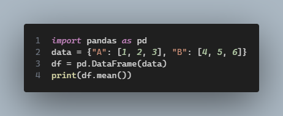
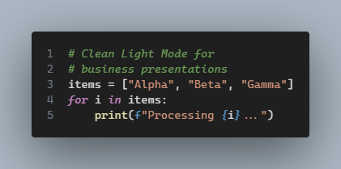

## Slide 1: Dark Mode Logic

:::: {.columns}

:::{.column width="40%"}
This code is rendered as an image with **Nord** theme and **Line Numbers**.

:::

:::{.column width="60%"}


:::
::::

---

## Slide 3 and 4
::: {.notes}
```python
import pandas as pd
data = {"A": [1, 2, 3], "B": [4, 5, 6]}
df = pd.DataFrame(data)
print(df.mean())
```
:::



---

## Slide 5 and 6

:::: {.columns}

::: {.column width="60%"}

::: {.notes}
```python

# Clean Light Mode for 
# business presentations
items = ["Alpha", "Beta", "Gamma"]
for i in items:
    print(f"Processing {i}...")
```
:::



:::

::: {.column width="40%"}

**Key Takeaways**

- Automatic Scaling: The image fits the column perfectly.

- Readable: No font issues across different computers.

- Pro Look: Includes the Mac-style window frame.
:::

::::

---

## How to Render This
1.  **Install the extension** (if you haven't yet):
    ```bash
    quarto add schochastics/quarto-code-screenshot
    ```
2.  **Render the file**:
    ```bash
    quarto render presentation.qmd --to pptx
    ```

---

## Quick Customization Cheat Sheet

| To change... | Use this in the code chunk (`#|`) |
| :--- | :--- |
| **Theme** | `screenshot-theme: "monokai"` |
| **Corner Rounding** | `screenshot-border-radius: 20` |
| **Shadow** | `screenshot-shadow: true` |
| **Width on Slide** | `out-width: "80%"` |

---

```js
console.log('test5')
```

