## ประวัติ

- สร้างโดย Gerald Sussman และ Guy Steele ปี ค.ศ. 1975 ที่ MIT
- พัฒนาจาก LISP ให้เรียบง่ายและสอดคล้องกับแคลคูลัสแลมบ์ดามากขึ้น

---

## โปรแกรมและนิพจน์

:::: {.columns}

::: {.column}
- ตัวโปรแกรมจะประกอบไปด้วยนิพจน์ซึ่งเขียนอยู่ในวงเล็บ ด้วยรูปแบบ prefix
:::

::: {.notes}
```scheme

```
:::

::: {.column}
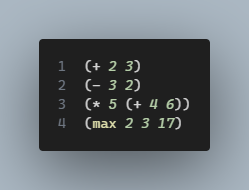
:::

::::

---

## นิพจน์

:::: {.columns}
:::{.column}
- สัญลักษณ์ตัวแรกที่ปรากฎภายในนิพจน์ เช่น `+, -, *, max` จะเป็น operator หรือ function
- สัญลักษณ์ที่ตามมาจะปรากฎเป็น operand
- ข้อดีของการใช้ prefix operator คือจะสามารถเขียนกับ operand จำนวนหลายๆตัวได้
- ใช้สัญลักษณ์ `;` แทนการ comment

:::
:::{.column}
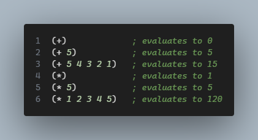
:::
::::

::: {.notes}
```scheme

```
:::

---

## นิพจน์ในภาษา Scheme

1. นิพจน์คณิตศาสตร์ (Arithmetic Expression)
2. นิพจน์ตรรกะ (Boolean Expression)
3. นิพจน์แบบมีเงื่อนไข (Conditional Expression)
4. นิพจน์แลมป์ดา (Lambda Expression)

---

## 1. นิพจน์คณิตศาสตร์ (Arithmetic Expression)

::::{.columns}
:::{.column}
- เป็นนิพจน์ที่ให้ค่าเป็นจำนวนเลข
:::

:::{.notes}
```scheme

```
:::

:::{.column}
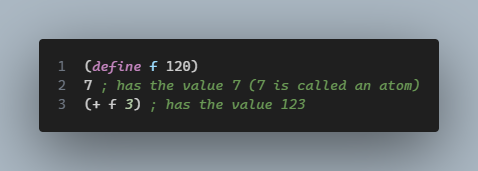

:::
::::
---

## 2. นิพจน์ตรรกะ (Boolean Expression)

::::{.columns}
:::{.column}
- ให้ค่า **True** แทนด้วย `#t`
- ให้ค่า **False** แทนด้วย `#f`
:::


:::{.notes}
```scheme

```
:::

:::{.column}
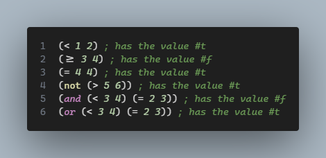
:::
::::
---


## 3. นิพจน์แบบมีเงื่อนไข (Conditional Expression)

1. ใช้ `if`

```scheme
(if <test> <true-expression> <false-expression>)
```

2. ใช้ `cond`

```scheme
(cond
  (<test-expr1> <exprssion1>)
  (<test-expr2> <exprssion3>)
  ...
  (else <else-expr>)
)
```
  
---

## 1. ใช้ `if`

::::{.columns}

:::{.column}
```scheme
(if <test> <true-expression> <false-expression>)
```
:::

:::{.column}
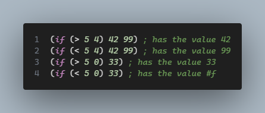
:::

:::{.notes}
```scheme

```
:::


::::

---

## 2. ใช้ `cond`
::::{.columns}
:::{.column}
```scheme
(cond
  (<test-expr1> <exprssion1>)
  (<test-expr2> <exprssion3>)
  ...
  (else <else-expr>)
)
```
:::
:::{.column}
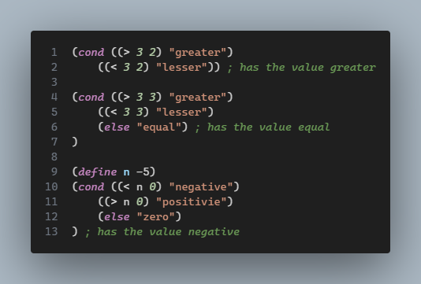
:::
:::{.notes}
```scheme

```
:::
::::

---


## 4. นิพจน์แลมป์ดา (Lambda Expression)
::::{.columns}
:::{.column}
- เป็นนิพจน์ที่ยามฟังก์ชัน
:::
:::{.column}
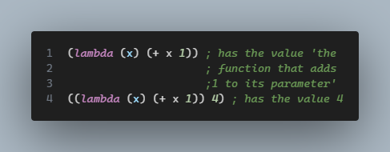
:::
:::{.notes}
```scheme

```
:::
::::

---

## ตัวอย่างฟังก์ชันบวกในแคลคูลัสแลมป์ดา

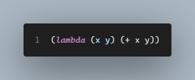


::: {.notes}

```scheme

```

:::

---

## ตัวอย่างการเรียกใช้ฟังก์ชัน

:::: {.columns}

::: {.column width="40%" }

- ส่งค่า 2 และ 3 เป็นพารามิเตอร์

:::

::: {.column width="60%"}

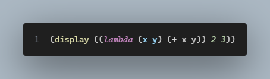

:::
::::

---

## ตัวอย่างการตั้งชื่อโดยใช้ฟังก์ชั่น DEFINE แบบเต็ม

:::{.notes}
```scheme

```
:::

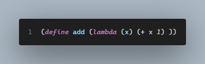

---

## ตัวอย่างการตั้งชื่อโดยใช้ฟังก์ชั่น DEFINE แบบย่อ

:::{.notes}
```scheme

```
:::

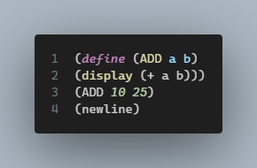

---

## ตัวอย่างการตั้งชื่อโดยใช้ฟังก์ชั่น DEFINE

:::{.notes}
```scheme

```
:::

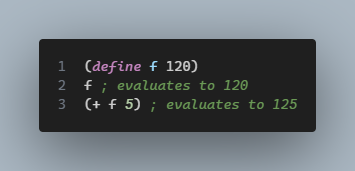


---

## ตัวอย่างการใช้ฟังก์ชันพิมพ์ออกทางหน้าจอ 


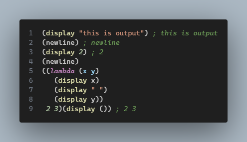


---

## โปรแกรมและข้อมูลในภาษา Scheme
::::{.columns}
:::{.column}
- โปรแกรมใช้โครงสร้างของ List แบบเดียว
:::
:::{.column}
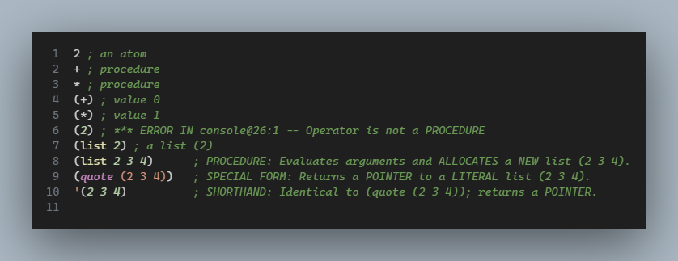
:::
:::{.notes}
```scheme

```
:::
::::

---

## Built-in Types (Primitive Types) or Atoms
::::{.columns}
:::{.column}
| Type       | Predicate    | Example               |
| ---------- | ------------ | --------------------- |
| Number     | (number? x)  | (number? 42) → #t     |
| Character  | (char? x)    | (char? #\\a) → #t     |
| String     | (string? x)  | (string? "hi") → #t   |
| Symbol     | (symbol? x)  | (symbol? 'apple) → #t |
| Boolean    | (boolean? x) | (boolean? #f) → #t    |
| Empty List | (null? x)    | (null? '()) → #t      |


:::
:::{.column}
- Because Scheme is dynamically typed, you often have to write "guard" clauses in your functions to prevent errors.
:::
:::{.notes}
```scheme

```
:::
::::

---

## Built-in Types

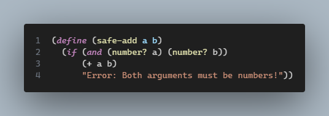

---

## Built-in Functions
::::{.columns}
:::{.column}

- max, min
- +, *, -, /
- quotient, modulo, remainder
- ceiling, floor, abs, magnitude, round, truncate
- gcd, lcm
- exp, log, sqrt
- sin, cos, tan
:::
:::{.column}
- <, >, =, <=, >=
- real?, number?, complex?, rational?, integer?
- zero?, positive?, negative?, odd?, even?, exact?
- and, or, not
- equal?, boolean?
- char?, char=?, char<=?, char>=?
:::
:::{.notes}
:::
::::

---

## ตัวอย่างการใช้งาน

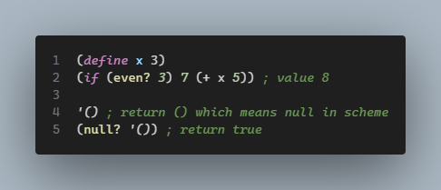

:::{.notes}
```scheme

```
:::

---

## ชนิดของข้อมูลลิสต์และการประมวลผลลิสต์
::::{.columns}
:::{.column}
- จากรูปแผนภูมิต้นไม้จะสังเกตได้ว่าลิสต์ทุกลิสต์จะมีสัญลักษณ์ลิสต์ว่าง (แทนด้วยเครื่องหมาย ()) ปิดท้ายอยู่เสมอ เพื่อบอกการสิ้นสุด
- สัญลักษณ์ () ที่ปิดท้ายจะเป็นประโยชชน์ในการทำงานกับลิสต์แบบเวียนบังเกิด (recursive)

:::
:::{.column}


:::
:::{.notes}
```scheme

```
:::
::::

